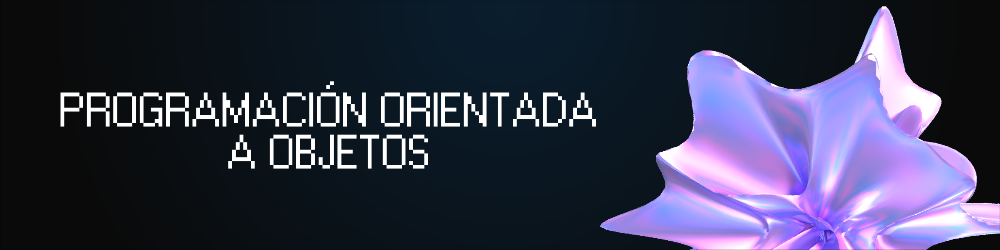

<h1 align="center">
  <a name="logo"></a>
</h1>

<h4 align="center">¿Este repo te fue útil? Dale una ⭐
  </br> 
  Si encontrás algún error o querés colaborar con el proyecto, hacé un 
  <a href="https://github.com/cpfiuna/mi-primer-pr">pull request</a>!
</h4>

## 📚 ¿Qué es Programación Orientada a Objetos?
Programación Orientada a Objetos (POO) es una materia fundamental en la formación de cualquier estudiante de ingeniería. Su objetivo principal es enseñar un paradigma de programación basado en el concepto de "objetos", que agrupan datos (atributos) y comportamientos (métodos). Se estudian principios clave como la encapsulación, la herencia, el polimorfismo y la abstracción, utilizando Java como lenguaje de implementación.

## 🤔 ¿Por qué usamos Programación Orientada a Objetos?
Usamos POO porque nos permite modelar problemas del mundo real de forma más natural e intuitiva. El uso de clases y objetos facilita la reutilización de código, el mantenimiento y la escalabilidad de los proyectos. Sin POO, el código se vuelve difícil de organizar, mantener y extender a medida que crece en complejidad.

## 🧠 ¿Cómo se usa la POO en programación?
Se usa como paradigma principal al diseñar y escribir programas. Por ejemplo:

- Usamos ***clases y objetos*** para modelar entidades del mundo real.
- Usamos ***encapsulación*** para proteger los datos y exponer solo lo necesario.
- Usamos ***herencia*** para reutilizar y extender el comportamiento de clases existentes.
- Usamos ***polimorfismo*** para que distintos objetos respondan de forma diferente a un mismo mensaje.
- Usamos ***interfaces y clases abstractas*** para definir contratos y estructuras flexibles.

En programación real, la POO es la base de la mayoría de los frameworks y aplicaciones modernas, y dominarla es esencial para cualquier desarrollador.

## Temas del curso

|  #  |  Unidad  |
|-----|----------|
| 1 | Paradigmas de Programación |
| 2 | Lenguajes de Programación Orientados a Objetos |
| 3 | Lenguaje de Programación Java |
| 4 | Conceptos Básicos de la Programación Orientada a Objetos |
| 5 | Notación UML |
| 6 | Modularidad en POO |
| 7 | Herencia y Polimorfismo |
| 8 | Genericidad y Persistencia |
| 9 | Introducción a las aplicaciones visuales |

## TAA - Primer Taller 2026 - Aplicación Motores

|  #  |  Título  |  Teoría  |  Dificultad                 
|-----|----------|----------|--------------
|1|[Aplicación Motores](/taa/primer-taller) | | 🟡 Intermedio
<!-- ||[]()|| -->

## 🛠️ Instrucciones de uso

1. Cloná el repositorio en tu máquina local:
   ```bash
   git clone https://github.com/davidgimenezs/programacion-orientada-a-objetos.git
   ```

2. Navegá a la carpeta del repositorio:
   ```bash
   cd programacion-orientada-a-objetos
   ```

3. Compilá y ejecutá cualquier archivo Java:
   ```bash
   javac "Semana 1/HolaMundo.java"
   java -cp "Semana 1" HolaMundo
   ```

4. Podés usar cualquier IDE compatible con Java como [IntelliJ IDEA](https://www.jetbrains.com/idea/), [Eclipse](https://www.eclipse.org/), [NetBeans](https://netbeans.apache.org/) o [VS Code](https://code.visualstudio.com/) con la extensión de Java.

## 📞 Contacto
Si tenés dudas o sugerencias, podés contactarme a través de GitHub o en mis redes sociales.

## 📄 Licencia
Este proyecto está bajo la licencia MIT - podés ver más detalles en el archivo LICENSE.
